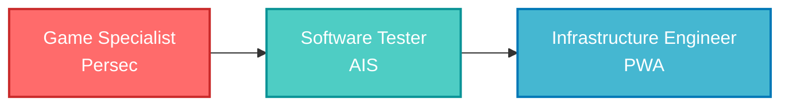

<div align="center">

<!-- Animated Typing Header -->


<p>
  <em>Bridging the gap between robust infrastructure and modern software development.</em>
</p>

<!-- Visitor Counter -->


<!-- Social Badges -->
<p>
  <a href="https://www.facebook.com/natiphong.jungin/" target="_blank">
    
  </a>
  <a href="mailto:natiphong.ju@gmail.com">
    
  </a>
  <a href="https://line.me/ti/p/cheeky4d">
    
  </a>
</p>


</div>

## 👨‍💻 About Me

```typescript
const natiphong = {
    role: "Infrastructure Engineer 🏗️",
    location: "Bangkok, Thailand 🇹🇭",
    company: "Provincial Waterworks Authority",
    background: "Software QA → Infrastructure",
    currentFocus: ["Data Center Optimization", "SAP Basis", "Kubernetes"],
    learning: ["React.js", "Next.js", "Advanced K8s Patterns"],
    hobbies: ["Automation 🤖", "System Architecture 📐", "Tech Exploration 🔍"],
    
    sayHi: () => console.log("Let's build something amazing together! 🚀")
};

natiphong.sayHi();
```


## 🛠️ My Tech Stack

Here are the tools and technologies I use to build, deploy, and maintain systems.

### ☁️ Infrastructure & DevOps
<p>
  <a href="https://kubernetes.io/" target="_blank">  </a>
  <a href="https://www.docker.com/" target="_blank">  </a>
  <a href="https://aws.amazon.com" target="_blank">  </a>
  <a href="https://www.terraform.io/" target="_blank">  </a>
  <a href="https://www.ansible.com/" target="_blank">  </a>
  <a href="https://www.linux.org/" target="_blank">  </a>
  <a href="https://www.nginx.com" target="_blank">  </a>
  <a href="https://grafana.com" target="_blank">  </a>
  <a href="https://prometheus.io" target="_blank">  </a>
</p>

### 🏢 Enterprise & Databases
<p>
  <a href="https://www.sap.com" target="_blank">  </a>
  <a href="https://www.oracle.com/" target="_blank">  </a>
  <a href="https://www.postgresql.org" target="_blank">  </a>
  <a href="https://www.mongodb.com/" target="_blank">  </a>
  <a href="https://redis.io" target="_blank">  </a>
  <a href="https://www.elastic.co" target="_blank">  </a>
</p>

### 💻 Development & Scripting
<p>
  <a href="https://www.python.org" target="_blank">  </a>
  <a href="https://golang.org" target="_blank">  </a>
  <a href="https://developer.mozilla.org/en-US/docs/Web/JavaScript" target="_blank">  </a>
  <a href="https://www.gnu.org/software/bash/" target="_blank">  </a>
  <a href="https://reactjs.org/" target="_blank">  </a>
  <a href="https://nextjs.org/" target="_blank">  </a>
  <a href="https://git-scm.com/" target="_blank">  </a>
</p>

### 🤖 AI & Machine Learning Tools
<p>
  <a href="https://openai.com" target="_blank">  </a>
  <a href="https://github.com/features/copilot" target="_blank">  </a>
  <a href="https://www.tensorflow.org" target="_blank">  </a>
  <a href="https://pytorch.org/" target="_blank">  </a>
  <a href="https://huggingface.co/" target="_blank">  </a>
</p>


## 💼 Professional Journey




## 🎯 Current Focus

<div align="center">

```yaml
2026_goals:
  infrastructure:
    - "Advanced Kubernetes patterns & service mesh"
    - "Multi-cloud architecture (AWS, GCP, Azure)"
    - "Infrastructure security hardening"
  
  development:
    - "Master React.js & Next.js ecosystem"
    - "Build full-stack applications"
    - "Contribute to open-source projects"
  
  automation:
    - "CI/CD pipeline optimization"
    - "GitOps workflows with ArgoCD"
    - "Python automation scripts"
```

</div>


## 🎵 Spotify Playlist

<div align="center">

### What I'm Listening To 🎧

[](https://open.spotify.com/playlist/3QSWFaeoyqts5vXwlm62i5?si=5aab5dc978b34d8b)

> *Click to listen my coding playlist! 🎶*

</div>


## 📫 Let's Connect!

<div align="center">

### 💬 Ask me about

**Infrastructure** • **SAP Basis** • **Kubernetes** • **Testing Automation** • **DevOps Best Practices**

### 📧 Reach Out

<p>
  <a href="mailto:natiphong.ju@gmail.com">
    
  </a>
  <a href="https://line.me/ti/p/cheeky4d">
    
  </a>
</p>


---

<p>
  
</p>

</div>
